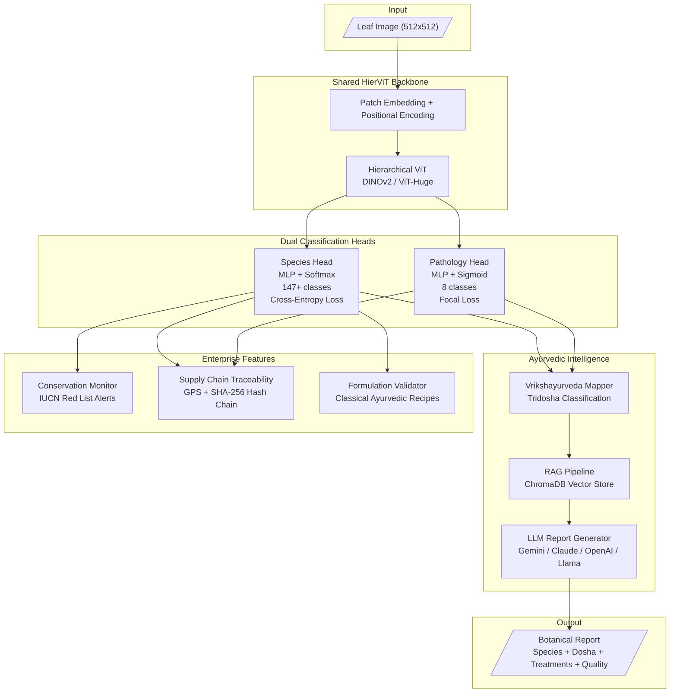
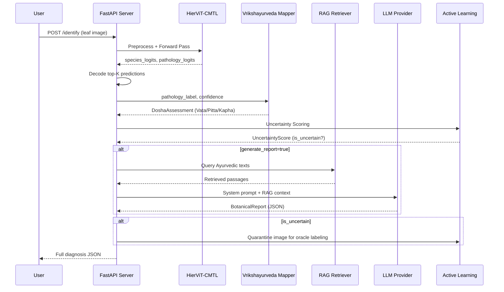
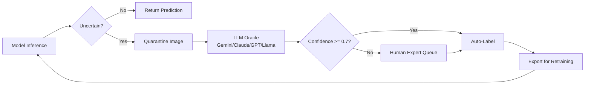
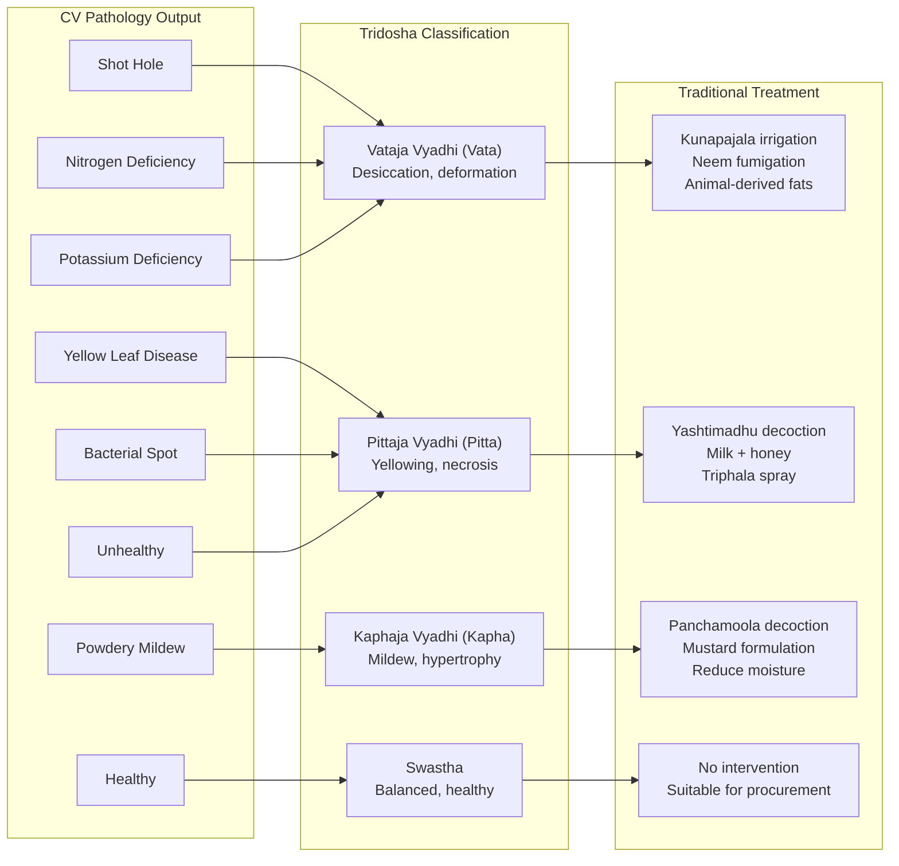
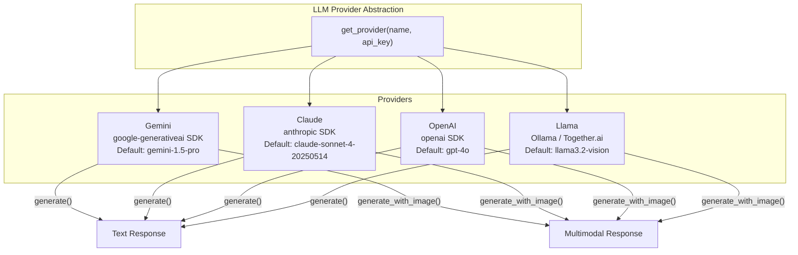

# PhytoVeda

**Multimodal Pharmacognosy: AI-Driven Botanical Identification and Textual Mapping in Ayurveda**

PhytoVeda is a dual-head Vision Transformer system that identifies 8,000+ medicinal plant species from leaf images, diagnoses plant health and disease status, maps pathological findings to the ancient Vrikshayurveda Tridosha framework (Vata/Pitta/Kapha), and prescribes traditional therapeutic interventions via a RAG-powered LLM indexed against classical Ayurvedic texts.

---

## Architecture



## Pipeline Flow



## Active Learning Loop



## Vrikshayurveda Dosha Mapping



## Multi-LLM Support

PhytoVeda supports **four LLM providers** for report generation and oracle classification:



| Provider | SDK | Models | Multimodal | Install |
|----------|-----|--------|------------|---------|
| **Gemini** | `google-generativeai` | gemini-1.5-pro, gemini-2.0-flash | Yes | Included by default |
| **Claude** | `anthropic` | claude-sonnet-4-20250514, claude-opus-4-20250514 | Yes | `pip install phytoveda[claude]` |
| **OpenAI** | `openai` | gpt-4o, gpt-4o-mini | Yes | `pip install phytoveda[openai]` |
| **Llama** | `openai` (Ollama API) | llama3.2-vision, llama3.1 | Yes | `pip install phytoveda[llama]` |

### Provider Configuration

```python
from phytoveda.llm.providers import get_provider

# Gemini (default)
llm = get_provider("gemini", api_key="AIza...")

# Claude
llm = get_provider("claude", api_key="sk-ant-api03-...")

# OpenAI
llm = get_provider("openai", api_key="sk-proj-...")

# Llama via Ollama (local, no API key needed)
llm = get_provider("llama")

# Llama via Together.ai (cloud)
llm = get_provider("llama", api_key="tog-...", base_url="https://api.together.xyz/v1")

# Custom model name
llm = get_provider("claude", model_name="claude-opus-4-20250514")
```

### Using with Report Generator

```python
from phytoveda.rag.report_generator import ReportGenerator

# Use Claude for report generation
gen = ReportGenerator(provider="claude", api_key="sk-ant-...")
report = gen.generate("Azadirachta indica", "Bacterial Spot", dosha, contexts)

# Use OpenAI
gen = ReportGenerator(provider="openai", api_key="sk-proj-...")

# Use local Llama
gen = ReportGenerator(provider="llama")

# Offline mode (no LLM needed)
report = gen.generate_offline("Neem", "Healthy", dosha)
```

### Using with Oracle (Active Learning)

```python
from phytoveda.active_learning.oracle import LLMOracle

# Use Claude for oracle classification
oracle = LLMOracle(provider="claude", api_key="sk-ant-...")

# Use local Llama
oracle = LLMOracle(provider="llama")
```

---

## Tech Stack

| Component | Technology |
|-----------|-----------|
| **Language** | Python 3.14+ (free-threaded, GIL disabled) |
| **Deep Learning** | PyTorch, timm (ViT model zoo) |
| **Model** | HierViT backbone (DINOv2 / ViT-Huge pretrained) |
| **Training** | Mixed precision (AMP), focal loss, dynamic task weighting |
| **LLM / RAG** | Gemini, Claude, OpenAI, Llama + ChromaDB vector store |
| **API** | FastAPI + Uvicorn |
| **Data** | ~103K+ images from 6 federated datasets, 512x512 px |
| **Cloud** | Google Colab Enterprise, Vertex AI, GCS |

## Datasets

| Dataset | Images | Species | Focus |
|---------|--------|---------|-------|
| Herbify | 6,104 | 91 | Healthy baselines, rich metadata |
| Assam Medicinal Leaf Set | 7,341 | 10 | Regional morphological variance (NE India) |
| AI-MedLeafX | 10,858 / 65,178 aug | 4 | Bacterial Spot, Shot Hole, Powdery Mildew, Yellow Leaf |
| CIMPD | 9,130 | 23 | Healthy vs. Unhealthy (unconstrained) |
| SIMP | 2,503 | 20 | Herbs, shrubs, creepers, climbers, trees |
| EarlyNSD | 2,700 | 3 | Nitrogen & Potassium deficiency |
| **Total** | **~38,636 orig / 103K+ aug** | **~147 unique** | |

---

## Setup

### Prerequisites

- Python 3.11+ (3.14+ recommended for free-threading)
- pip or uv package manager
- Git

### Installation

```bash
# Clone the repository
git clone https://github.com/kautilyaa/PhytoVeda.git
cd PhytoVeda

# Install core package
pip install -e .

# Install with dev tools (pytest, ruff, mypy)
pip install -e ".[dev]"

# Install with specific LLM providers
pip install -e ".[claude]"        # Anthropic Claude
pip install -e ".[openai]"        # OpenAI GPT
pip install -e ".[llama]"         # Meta Llama (via Ollama)
pip install -e ".[all-llms]"      # All LLM providers

# Install with GPU support
pip install -e ".[gpu]"
```

### For Local Llama (Ollama)

```bash
# Install Ollama (macOS)
brew install ollama

# Pull a vision model
ollama pull llama3.2-vision

# Start the Ollama server (runs on localhost:11434)
ollama serve
```

### Verify Installation

```bash
# Run the test suite
pytest tests/ -v

# Check linting
ruff check src/
```

---

## Google Colab

PhytoVeda has native Colab support with Google Drive persistence. Open `notebooks/phytoveda_colab.ipynb` in Colab for the full pipeline.

**Storage strategy**: Datasets download to Colab SSD (`/content/`) for fast I/O. Everything else (checkpoints, results, ChromaDB, reports, quarantine) persists to Google Drive.

```python
from phytoveda.colab import DriveManager, ColabEnvironment

# Mount Drive + scaffold directories
dm = DriveManager()
dm.mount()
dm.scaffold()

# Path references
dm.datasets_dir      # /content/datasets (SSD — fast, ephemeral)
dm.checkpoints_dir   # Drive/PhytoVeda/checkpoints (persistent)
dm.results_dir       # Drive/PhytoVeda/results (persistent)
dm.chromadb_dir      # Drive/PhytoVeda/chromadb (persistent)
dm.reports_dir       # Drive/PhytoVeda/reports (persistent)
dm.quarantine_dir    # Drive/PhytoVeda/quarantine (persistent)

# Sync files between SSD and Drive
dm.sync_to_drive(ssd_file, "results")
dm.sync_from_drive("checkpoints/best_model.pt", local_path)

# Environment info
env = ColabEnvironment()
print(env.summary())       # GPU, Python version, packages
print(env.check_ready())   # Readiness checks
```

---

## Usage

### 1. Training

```bash
# Train with default config
python -m phytoveda.training.trainer --config configs/hiervit_cmtl.yaml

# Train with overrides
python -m phytoveda.training.trainer \
    --config configs/hiervit_cmtl.yaml \
    --epochs 50 --lr 1e-4 --batch-size 32

# Resume from checkpoint
python -m phytoveda.training.trainer \
    --config configs/hiervit_cmtl.yaml \
    --resume checkpoints/best_model.pt
```

### 2. Inference API Server

```bash
# Basic server (model only)
python -m phytoveda.api.server --checkpoint checkpoints/best_model.pt

# With RAG + LLM report generation
python -m phytoveda.api.server \
    --checkpoint checkpoints/best_model.pt \
    --chromadb-dir data/chromadb \
    --gemini-api-key $GEMINI_API_KEY

# Custom host/port
python -m phytoveda.api.server \
    --checkpoint checkpoints/best_model.pt \
    --host 0.0.0.0 --port 8080
```

### 3. API Endpoints

#### `POST /identify` — Identify a plant from a leaf image

```bash
curl -X POST http://localhost:8000/identify \
    -F "file=@leaf_photo.jpg" \
    -F "top_k=5" \
    -F "generate_report=false"
```

**Response:**

```json
{
    "species_name": "Azadirachta indica",
    "species_confidence": 0.9423,
    "top_k_species": [
        {"name": "Azadirachta indica", "confidence": 0.9423},
        {"name": "Melia azedarach", "confidence": 0.0312}
    ],
    "pathology_label": "Bacterial Spot",
    "pathology_confidence": 0.8756,
    "top_k_pathology": [
        {"name": "Bacterial Spot", "confidence": 0.8756},
        {"name": "Healthy", "confidence": 0.0891}
    ],
    "dosha": {
        "dosha": "Pittaja Vyadhi",
        "confidence": 0.8756,
        "cv_features": ["RGB/HSV colorimetric shifts", "Localized necrotic lesions"],
        "classical_symptoms": ["Inability to withstand solar radiation", "Profound yellowing"],
        "treatments": ["Root irrigation with Yashtimadhu decoction", "Apply milk + honey"],
        "contraindications": ["Avoid heating interventions"]
    },
    "uncertainty": {
        "least_confidence": 0.0577,
        "margin": 0.9111,
        "entropy": 0.4321,
        "combined": 0.1823,
        "is_uncertain": false
    },
    "inference_time_ms": 45.2
}
```

#### `GET /health` — Service health check

```bash
curl http://localhost:8000/health
```

```json
{
    "status": "healthy",
    "model_loaded": true,
    "device": "cuda",
    "uptime_seconds": 3612.5
}
```

#### `GET /model/version` — Model version and metrics

```bash
curl http://localhost:8000/model/version
```

```json
{
    "version": "v0.1",
    "checkpoint": "checkpoints/best_model.pt",
    "metrics": {"species_f1": 0.92, "pathology_f1": 0.89},
    "device": "cuda",
    "num_species": 147
}
```

### 4. Python API

```python
from PIL import Image
from phytoveda.api.inference import InferencePipeline

# Load from checkpoint
pipeline = InferencePipeline.from_checkpoint("checkpoints/best_model.pt")

# Predict
image = Image.open("leaf.jpg")
result = pipeline.predict(image, top_k=5, generate_report=False)

print(f"Species: {result.species_name} ({result.species_confidence:.1%})")
print(f"Pathology: {result.pathology_label}")
print(f"Dosha: {result.dosha.dosha.value}")
print(f"Treatments: {result.dosha.treatments}")
```

### 5. Conservation Monitoring

```python
from phytoveda.conservation.iucn import ConservationRegistry

registry = ConservationRegistry()

# Check if identified species is endangered
alert = registry.check("Santalum album")
if alert:
    print(f"{alert.severity}: {alert.message}")
    print(f"Harvest allowed: {alert.harvest_allowed}")

# List all threatened species in registry
for sp in registry.get_threatened_species():
    print(f"  {sp.status.name}: {sp.scientific_name} — {sp.notes}")
```

### 6. Supply Chain Traceability

```python
from phytoveda.traceability.events import EventLedger

ledger = EventLedger(persist_path="data/events.jsonl")

# Log an identification event with GPS
event = ledger.record(
    species="Azadirachta indica",
    pathology="Healthy",
    species_confidence=0.95,
    latitude=12.9716, longitude=77.5946,
    operator_id="tech-042",
    batch_id="BATCH-2026-001",
)
print(f"Event hash: {event.event_hash}")

# Verify chain integrity (tamper detection)
assert ledger.verify_chain()

# Biodiversity mapping
print(ledger.biodiversity_summary())
```

### 7. Formulation Validation

```python
from phytoveda.formulation.validator import FormulationValidator, IdentifiedHerb

validator = FormulationValidator()

# Validate a Triphala formulation
herbs = [
    IdentifiedHerb("Terminalia chebula", "Healthy", 0.95, is_healthy=True),
    IdentifiedHerb("Terminalia bellirica", "Healthy", 0.91, is_healthy=True),
    IdentifiedHerb("Emblica officinalis", "Powdery Mildew", 0.88, is_healthy=False),
]

result = validator.validate("Triphala", herbs)
print(f"Quality: {result.overall_quality}")  # "conditional"
print(f"Warnings: {result.warnings}")
# ["Amalaki (Emblica officinalis): Powdery Mildew — treat before use"]
```

---

## Project Structure

```
PhytoVeda/
    README.md                         # This file
    CLAUDE.md                         # Claude Code context
    ROADMAP.md                        # Implementation roadmap (all phases complete)
    pyproject.toml                    # Python project config
    configs/
        hiervit_cmtl.yaml            # Model + training configuration
    src/phytoveda/
        data/                         # Data pipeline
            datasets.py               # 6 dataset loaders + FederatedBotanicalDataset
            augmentation.py           # Albumentations augmentation pipeline
            preprocessing.py          # 512x512 normalization
            taxonomy.py               # Species + pathology label unification
            download.py               # Dataset download utilities
        models/                       # Neural network
            backbone.py               # HierViT backbone (timm)
            heads.py                  # Species + Pathology classification heads
            cmtl.py                   # Combined CMTL model
            losses.py                 # Focal loss + dynamic task weighting
        training/                     # Training pipeline
            trainer.py                # Training loop with AMP + checkpointing
            evaluation.py             # F1, accuracy, confusion matrices
        vrikshayurveda/               # Ancient plant science
            mapper.py                 # Pathology -> Tridosha Dosha mapping
        llm/                          # LLM provider abstraction
            providers.py              # Gemini, Claude, OpenAI, Llama support
        rag/                          # Retrieval-Augmented Generation
            indexer.py                # Text chunking + ChromaDB indexing
            retriever.py              # Semantic search over Ayurvedic texts
            report_generator.py       # LLM-powered botanical report synthesis
        active_learning/              # Continuous learning
            uncertainty.py            # Least confidence, margin, entropy sampling
            quarantine.py             # Uncertain image quarantine + manifest
            oracle.py                 # LLM oracle + human expert labeling
        conservation/                 # Ecological monitoring
            iucn.py                   # IUCN Red List registry + alerts
        traceability/                 # Supply chain
            events.py                 # GPS event logging + SHA-256 hash chain
        formulation/                  # Ayurvedic recipe validation
            validator.py              # Classical formulation cross-referencing
        colab/                        # Google Colab integration
            drive.py                  # DriveManager: SSD + Drive path strategy
            environment.py            # ColabEnvironment: GPU, packages, setup
            training.py               # ColabTrainer: grad accum, crash ckpt, GPU monitor
            data_cache.py             # DatasetCache: split/taxonomy/history caching
        api/                          # Inference server
            server.py                 # FastAPI endpoints
            inference.py              # Full inference pipeline orchestration
    notebooks/
        phytoveda_colab.ipynb         # Full pipeline Colab notebook
    tests/                            # 370 tests
```

## Test Suite

```bash
pytest tests/ -v
```

| Test File | Tests | Coverage |
|-----------|-------|---------|
| `test_data.py` | 76 | Taxonomy, 6 dataset loaders, augmentation, preprocessing |
| `test_models.py` | 3 | FocalLoss, CMTLLoss |
| `test_training.py` | 22 | Trainer, evaluation, checkpointing |
| `test_vrikshayurveda.py` | 5 | Dosha mapping |
| `test_uncertainty.py` | 4 | Uncertainty scoring |
| `test_rag.py` | 28 | Indexer, retriever, report generator |
| `test_active_learning.py` | 20 | Quarantine, oracle pipeline |
| `test_api.py` | 30 | Inference pipeline, FastAPI endpoints |
| `test_conservation.py` | 17 | IUCN registry, conservation alerts |
| `test_traceability.py` | 15 | GPS, hash chain, event ledger |
| `test_formulation.py` | 17 | Formulation validation |
| `test_llm_providers.py` | 24 | Multi-LLM provider abstraction |
| `test_colab.py` | 57 | DriveManager, ColabEnvironment |
| `test_colab_training.py` | 52 | Gradient accumulation, crash checkpointing, GPU monitor, dataset cache |
| **Total** | **370** | |

---

## RAG Knowledge Base

The LLM is indexed against classical Ayurvedic texts for grounded report generation:

1. **Charaka Samhita** -- foundational Ayurvedic medical text
2. **Susruta Samhita** -- classical surgical/medical text
3. **Ayurvedic Pharmacopoeia of India (API)** -- official pharmacological reference
4. **Vrikshayurveda** -- plant science texts by Surapala and Varahamihira

Reports include: authenticated botanical identity, classical medicinal properties (Rasa/Guna/Virya/Vipaka), health status, Vrikshayurveda Dosha assessment, traditional treatments, and pharmaceutical procurement quality.

## Loss Function

```
L_total(t) = w_species(t) * L_species + w_disease(t) * L_disease + lambda * L_reg
```

- **L_species**: Cross-Entropy loss for species identification
- **L_disease**: Focal loss for disease classification (gamma=2.0, handles class imbalance)
- **w(t)**: Dynamic Weight Average — weights updated per epoch via softmax on loss ratios
- **L_reg**: Entropy regularization on species predictions

## Configuration

All hyperparameters are in `configs/hiervit_cmtl.yaml`:

```yaml
model:
  backbone: "vit_huge_patch14_dinov2.lvd142m"
  image_size: 512

training:
  epochs: 100
  batch_size: 16
  learning_rate: 1.0e-4
  warmup_epochs: 5
  mixed_precision: true

loss:
  focal_gamma: 2.0
  weighting_strategy: "dwa"

active_learning:
  confidence_threshold: 0.5
  margin_threshold: 0.1
  oracle: "gemini-1.5-pro"
```

---

## License

MIT
